# @NaguioMervina

---

<table>
<tr>
<td valign="top" width="50%">

 
<strong>Mervin Naguio</strong>
 
<em>ad astra per aspera</em>
 
 
<a href="https://github.com/NaguioMervina?tab=repositories">View my repositories</a>
</td>
<td valign="top" width="50%">

</td>
</tr>
</table>

## Most Used Languages

  

